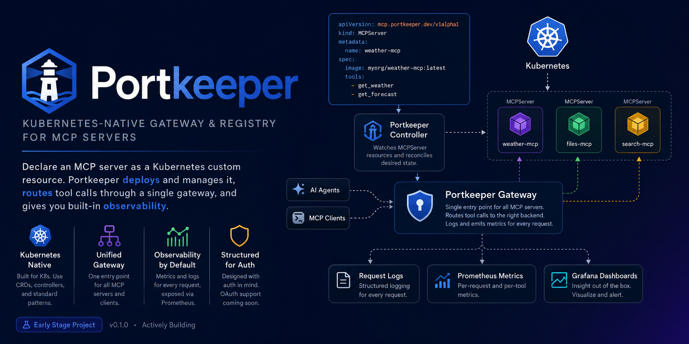

# PortKeeper

//A Kubernetes-native gateway and registry for MCP (Model Context Protocol) servers.



## Why this exists

Teams running multiple MCP servers today have no shared way to discover them,
authenticate calls to them, or see who's calling what. This project turns
"a pile of MCP servers" into a managed fleet — the same shift Kubernetes made
for containers.

- **Registry**: MCP servers are declared as a Kubernetes Custom Resource
  (`MCPServer`), so `kubectl get mcpservers` just works.
- **Gateway**: a single entrypoint that all clients/agents talk to. It looks
  up the live registry via the Kubernetes API and routes each request to the
  right backend.
- **Observability**: proxied HTTP requests are logged and exported as
  Prometheus metrics. For MCP endpoints these are transport-request metrics,
  not individual tool-call metrics.

See [PLAN.md](./PLAN.md) for the full design rationale and roadmap, and
[docs/architecture.md](./docs/architecture.md) for how the pieces fit
together.

## Repo layout

```
cmd/
  controller/     # entrypoint for the MCPServer controller (operator)
  gateway/        # entrypoint for the gateway/proxy
api/v1alpha1/     # the MCPServer CRD Go types
internal/
  controller/     # reconcile loop: MCPServer -> Deployment + Service
  gateway/        # registry lookup, routing, proxying, metrics
config/
  crd/            # generated CRD YAML
  samples/        # example MCPServer objects
  rbac/           # controller's RBAC permissions
deploy/           # kind cluster config + gateway deployment manifest
docs/             # architecture notes
```

## Status

The real MCP workflow now runs entirely in kind: an `MCPServer` resource
creates the runbook backend, and an SDK client discovers and calls its tool
through the in-cluster gateway. CI runs the same workflow.
Readiness follows the current Deployment rollout, and namespaced routes
isolate same-name backends. The demo also exercises updates, recovery,
owned-resource recreation, and Kubernetes garbage collection.
The gateway authenticates audience-bound Kubernetes ServiceAccount tokens
and applies deny-by-default per-server policy. The kind workflow enforces
backend NetworkPolicy with Calico and demonstrates direct-access denial. See
[authentication and migration](docs/authentication.md).
See [PLAN.md](./PLAN.md) for the checkpoint roadmap and acceptance criteria.

## Build and test

The root module requires Go 1.25 or newer (required by the pinned official
MCP SDK). The standalone toy backend retains its own module.

```bash
make build
make test

# Real SDK client -> gateway -> runbook MCP server, without a cluster.
go test -race ./internal/gateway -run '^TestMCPInteroperability$' -count=1 -v

# Focused streaming and cancellation regression.
go test -race ./internal/gateway -run '^TestRouterStreamsAndCancels$' -count=1
```

## Kubernetes MCP demo

With Docker running, kind v0.33.0, and kubectl v1.35 or v1.36 installed:

```bash
make e2e
```

This builds four local images, creates an isolated kind cluster, installs the
policy-enforcing CNI, controller and gateway with their ServiceAccounts/RBAC,
declares the runbook
backend, and runs a real MCP client Job. The client discovers `read_runbook`
and retrieves a document over cluster DNS through the gateway Service using
a projected ServiceAccount token. Denied identities, spoofed headers and
direct-backend connection attempts are also exercised.

The script uses its own kubeconfig and deletes only the cluster it created.
Logs and a captured terminal walkthrough are left in
`artifacts/e2e.*/logs/`; kubeconfigs are not included in CI artifacts.
Use `KEEP_CLUSTER=1 make e2e` to retain the cluster for inspection.

See the [walkthrough and manual client commands](docs/kubernetes-demo.md)
and a [captured successful run](docs/demo.txt).

### Real MCP endpoint

Each backend serves Streamable HTTP at `/mcp`; clients address it through
the gateway at `/<namespace>/<server-name>/mcp` and must send
`Authorization: Bearer <gateway-audience-ServiceAccount-token>` on every
request. The server must allow the client in `spec.allowedServiceAccounts`.
`X-Agent-ID` is ignored as identity and overwritten with the verified
ServiceAccount username upstream; gateway credentials are stripped.
The gateway forwards the body, protocol/session headers, and
streamed responses rather than aggregating tools or terminating MCP.
Legacy `/<server-name>/<endpoint>` routes work when the server name is unique
across the cluster; ambiguous names return **409 Conflict** rather than
selecting an arbitrary backend. Namespaced toy routes also work.

The read-only demo backend embeds two operational runbooks and exposes
`read_runbook` with the topics `gateway-routing` and `rate-limiting`. It
cannot read arbitrary files or execute commands. To run the backend alone:

```bash
make run-runbook-server
# MCP endpoint: http://127.0.0.1:9001/mcp
```

`RUNBOOK_ADDR` overrides the loopback-only default. This command does not
register the backend with Kubernetes or start a gateway. The integration
test above starts both HTTP servers with an in-memory registry entry,
connects an actual SDK client, discovers the tool, and reads both documents.
These local tests stub TokenReview; the kind workflow uses the real API.

For authenticated, authorized clients, known but unready servers return
**503** with `Retry-After: 5`; unknown
servers return **404**. A failed connection to a cached-ready backend returns
**502**. Readiness uses current-generation conditions and Deployment
availability with a TCP probe; it is not an application-level MCP health check.
The registry polls every five seconds and retains its previous snapshot on
API errors, so status changes are not instantaneous. Authorization fails
closed after 15 seconds without a fresh policy snapshot. Missing or invalid
tokens return **401**, policy denial **403**, and unavailable TokenReview **503**.

Current limitations: rate limits count HTTP requests, including
MCP control messages. Existing metrics use `tool="mcp"` for these requests
and record long-lived streams only when they finish. Metrics and logs include
the resolved namespace; unresolved legacy requests have an empty namespace.
Rate-limit state is capped at 10,000 identities per process; replicas do not
share quotas. Protocol-aware observability remains roadmap work.

## Local development

The existing toy demo runs on [`kind`](https://kind.sigs.k8s.io/)
(Kubernetes-in-Docker) so you don't need real cloud infra to iterate.

```bash
# 0. Build the toy demo MCP server image (used by config/samples/)
docker build -t toy-mcp-server:0.1 hack/toy-mcp-server

# 1. Spin up a local cluster and load the toy image into it
kind create cluster --config deploy/kind-config.yaml
kind load docker-image toy-mcp-server:0.1

# 2. Install the CRD
kubectl apply -f config/crd/bases/

# 3. Run the controller locally (against the kind cluster)
go run ./cmd/controller

# 4. Register a sample MCP server
kubectl create serviceaccount mcp-demo-client
kubectl apply -f config/samples/mcp_v1alpha1_mcpserver.yaml

# 5. In another terminal, make the backend reachable from the host and
#    run the gateway. (In-cluster the gateway uses cluster DNS; locally,
#    GATEWAY_BACKEND_HOST + a port-forward stand in for it.)
#    Optional: GATEWAY_RATE_LIMIT_RPS / GATEWAY_RATE_LIMIT_BURST tune the
#    per-agent rate limit (defaults: 5 req/s, burst 10).
kubectl port-forward svc/demo-server-svc 9000:9000 &
BACKEND_FORWARD_PID=$!
GATEWAY_BACKEND_HOST=localhost go run ./cmd/gateway

# 6. In another shell, issue a short-lived gateway token using your local
#    cluster-admin kubeconfig. Keep it out of logs and source control.
TOKEN_FILE="$(mktemp)"
chmod 600 "$TOKEN_FILE"
kubectl create token mcp-demo-client --audience=portkeeper --duration=10m \
  > "$TOKEN_FILE"
# curl reads the credential from stdin rather than a command-line argument.
printf 'Authorization: Bearer %s\n' "$(tr -d '\n' < "$TOKEN_FILE")" |
  curl -X POST -H @- -d 'hello portkeeper' \
  http://localhost:8080/demo-server/echo
```

This host-run toy setup does not enforce backend network isolation. Use
`make e2e` for the policy-enforcing deployment. Manually issued tokens expire;
reissue the token when necessary and delete its file when finished.

### Metrics dashboard (Prometheus + Grafana)

Optional, for watching the system work: a minimal in-cluster Prometheus +
Grafana that visualize the gateway's `/metrics` (call rate, latency
quantiles, error rate). No persistence, no auth — demo only.

With the demo above already running (gateway on the host at :8080):

```bash
# 1. Deploy Prometheus + Grafana into the kind cluster
kubectl apply -f deploy/prometheus.yaml -f deploy/grafana.yaml
kubectl rollout status deploy/prometheus deploy/grafana

# 2. Open Grafana (no login needed)
kubectl port-forward svc/grafana 3000:3000
# -> http://localhost:3000/d/portkeeper

# 3. Generate some traffic and watch the panels move
while true; do
  printf 'Authorization: Bearer %s\n' "$(tr -d '\n' < "$TOKEN_FILE")" |
    curl -s -X POST -H @- -d hi \
      http://localhost:8080/demo-server/echo > /dev/null
  sleep 1
done
```

Local-dev wrinkle: the gateway runs on the *host* (`go run`), so in-cluster
Prometheus scrapes it at `host.docker.internal:8080` — a name Docker Desktop
resolves to the host from inside containers, which kind pods inherit via
CoreDNS. If you deploy the gateway in-cluster instead, point the scrape
config in `deploy/prometheus.yaml` at the gateway Service.

### Stop the local demo

Press `Ctrl-C` in the terminals running the controller, gateway, Grafana
port-forward, or traffic loop. Then stop the background backend port-forward
and delete the cluster:

```bash
# Run this in the shell where BACKEND_FORWARD_PID was set above.
kill "$BACKEND_FORWARD_PID"

# Run in the shell where TOKEN_FILE was set.
rm -f "$TOKEN_FILE"

# Deletes the kind cluster and everything deployed in it, including the
# demo server, Prometheus, and Grafana.
kind delete cluster --name kind
```

To keep the cluster but remove only the monitoring stack:

```bash
kubectl delete -f deploy/grafana.yaml -f deploy/prometheus.yaml
```

See `Makefile` for shortcuts to the above.
